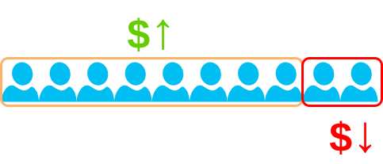
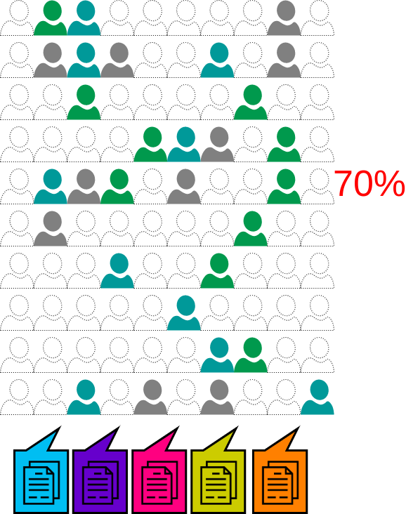
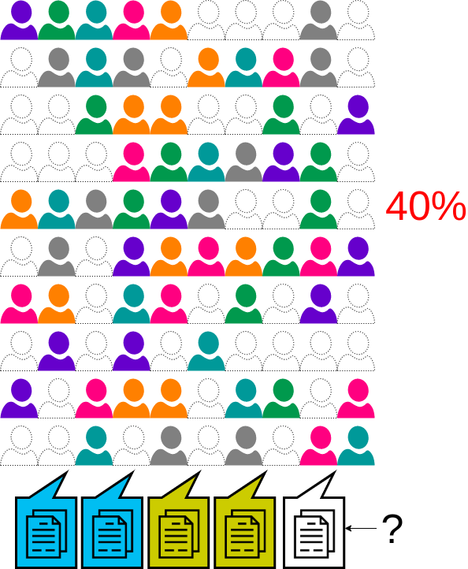

Every consultancy is concerned about utilization numbers. In this post I want to
explore what utilization is and how it impacts the delivery of the services you
as a customer contracted them to deliver. This is yet another facet to consider
next to [cloud partner programs](/blog/cloud-partner-programs/) when vetting
your consultants.

## The Single Purpose Consultancy

First let's start simple. Lets consider you have a single purpose consultancy.
For simplicity you have a series of highly skilled engineers in one cloud
provider, and this is what your company specializes in.

So no consultancy usually operates at 100% billable. You may find they ideally
operate at 80%, maybe more or maybe less, depending on their strategy.

Of course these 20% are engineers that do not bring in any revenue, but quite
the opposite are sucking up revenue, because they have to be paid.

But it is all quite necessary. There are a lot of activities you need to engage
in, to maintain a consultancy, to ensure your engineers don't leave, to solidify
your position in the market, and to maintain your level of skill.

So those 20% are doing things like:

- Attending trainings
- Building stuff you can demo
- Researching new tech
- Writing blog posts
- Attending conferences

Another very important reason you would maintain this reserve is anticipation of
the next contract.

Every consultancy tries to maintain a steady sales pipeline and they don't want
to be left understaffed if a great opportunity comes knocking. When you do
secure that contract and (if you are looking to grow) you will then add more
engineers (if you can find them) so you are no longer operating at 100%.

Consultancy growth is a bit of a tight rope walk. Unless your contracts are
projected out a year ahead and you are absolutely positive your engineers won't
just get up and leave, you are almost constantly trying to balance utilization.
As you grow your sales pipelines need to grow more robust as your financial risk
from underutilization grows much larger.

This was a very over simplified example, but it is only here so we can
extrapolate to larger examples.

## The Do All Consultancy

If you look at some of the large System Integrators (SI) we see they tend to
cover everything under the sun from SAP, Oracle, cloud migration, DevOps,
Containers, Blockchain and whatever else may be in demand at the time. In most
cases you will see that they do in fact have this diverse talent pool.

So lets says they are able to pull in a diverse set of contracts.

In the above graphic you can see 70% utilization. That is not a bad number, but
it is also not great. Now lets consider your pipeline only sees demand for SAP
and AWS. With another contract unfulfilled because you don't have any AWS people
left.

No company could operate like this. 40% utilization is not tenable, even on the
short term. So what is normally done, is what I like to call "engineer packing".

This is where you take a few experts in their respective field and have them
consult with the customer directly, sometimes moving them from project to
project, while implementation is actually performed by people that are learning
that particular system on the job.

You are now paying for talented engineers, but they just are not talented in
what you need.

## Overhead

These issues exponentially grow as you deal with large international consultants
which try to maximize profit by near shoring or off shoring the work being done.
This can bring in a large number of issues around hand off confusion,
communication problems, hours dedicated, etc.

This is further compounded by regional account relationships, profit allocations
and their own internal politics. Which is all beyond the scope of this article.

Of course there is finally the issue of the massive overhead these large
consultants generate. Every non-engineer in your tech consultancy is someone you
are paying for but is not generating value for your company. These sources of
overhead eventually leads to diluting the talent pool further, because as a
whole they should be figured into utilization.

## Conclusion

Just like my previous article on
[Cloud Partner Programs](/blog/cloud-partner-programs/) you have to find a way
to vet the teams you are offered either through hiring or contracting someone
capable of vetting these teams.

Also take the time to evaluate the consultancy itself. Check if their staff is
60% C level, operations, marketing, or anyone else that cannot deliver for you.
These extra staff will either drive up costs or drive down quality, most likely
both.

## FikaWorks

At FikaWorks we work as direct hires with your company, with little to no
overhead. We have no drive to grow because it is not incentivized. We do want to
be gainfully employed, but we recognize brand trust is our best way to meet that
goal. This is why every time we consider a new member we recognize they must
serve our brand, meaning we grow with great caution.
