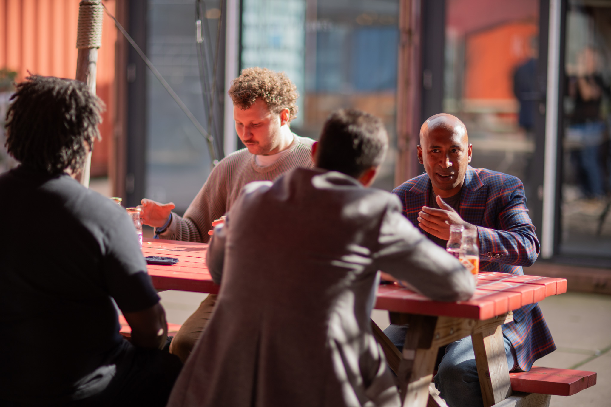
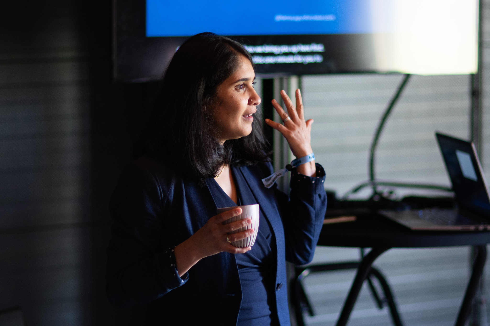
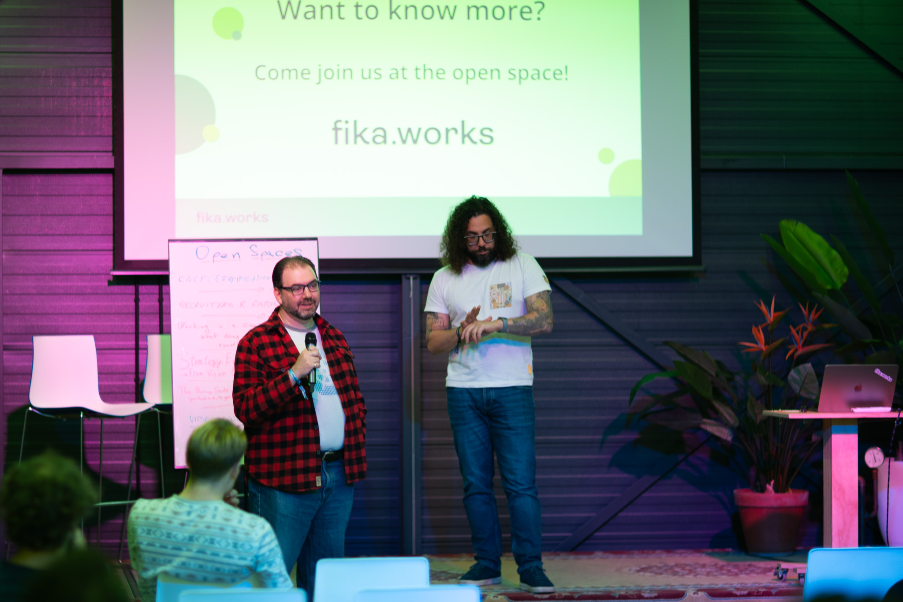

+++
author = 'Catalin Jora'
date = '2025-10-17T10:20:17+02:00'
draft = false
image = 'fikaworks_day_2025_2.jpg'
tags = ['un-conference', 'collective', 'fikaworks', 'company', 'coop', 'entrepreneurship']
title = 'Why We Organized Fikaworks Day Differently—And Why It Matters'
+++

After our initial gathering in Haarlem (NL) in 2024, we just knew we were onto something good. We were seriously tired of the traditional "broadcast" model—the kind where people sit nodding along to everything that's on the stage. We believed, fundamentally, that we can build a different type of event. So, we organized the second Fikaworks Day in Amsterdam. This time, with clarity on what we were fighting against and why it matters. We wanted a peer-to-peer exchange where everyone can share and learn at the same time.

### The Luxury of Face-to-Face: Our Core Intent

We work in an industry obsessed with remote-first culture, yet we've forgotten something fundamental: there's no substitute for genuine, face-to-face time. Not for networking. For **collaboration**. For the kind of thinking that happens when smart people are in the same room, building something together. We gathered the builders, the doers, the founders, the veterans—people who make things happen.  We intentionally flipped the script, setting the expectation that every attendee was an active collaborator, not a passive consumer.

To achieve that two-way dynamic, we had to ditch all the regular corporate stuff, with deliberated design choices:

- **Zero Corporate Pitches**: We had no sponsor booths, no sales pitches; we kept the focus strictly on exchange and expertise. Not because we're anti-business—we're not. But because the moment you introduce a transaction, the dynamic shifts.

- **Trust Beats Tracking**: There was no badge scanning or lead generation. This day was about fostering genuine human connection and peer-to-peer trust.

- **Vibes Over Branding**: No glossy roll-ups and rigid branding. Festival wristbands, wooden panels, raw energy—matching the fast, future-focused vibe of the industry.

Our venue, the unique [Startup Village](https://startupvillage.nl/) at Science Park, was the perfect backdrop. As a dynamic location, in the middle of a university campus, it perfectly embodied the necessity of leveraging the resources we have now to shape the future.

### What We Actually Built Into the Day

We carefully curated the day to balance hands-on, high-impact and actionable knowledge. Our focus was on tech, business, and personal development:

*Entrepreneurial Foundations:* We got an unfiltered perspective from [Sander Rodenhuis](https://www.linkedin.com/in/srodenhuis/) on the raw journey of launching, developing, and successfully exiting a Cloud Native software business—the true story, warts and all.

*The Technical Edge:* The content was never theoretical, we focused on real-world implementations, from deploying AI infrastructure for wildfire mitigation to solving complex Image Distribution challenges, culminating in a hands-on MCP workshop demonstrating agentic workflows for Kubernetes diagnostics.

*Independent Professional Skills*: We dedicated time to the skills that power our careers, including [Neha Lagoo Ratnakar](https://www.linkedin.com/in/neharatnakar/)'s practical workshop on Enhancing Facilitation Skills (Code, Coach, Conquer!) and a session on Technical Book Authorship.

*The Open Space Model:* The Heart of the Day: The afternoon was dedicated to the participant-driven Open Space. This is the collaborative core where attendees set the agenda on the spot, ensuring every conversation was directly relevant to the most pressing, current challenges, driving real-time, collective problem-solving (from Cooperatively working, to Vibe Coding and Certifications).

 Especially when it comes to AI—there are no best practices yet. Every new tool, every new workflow, every emerging model is uncharted territory. Fikaworks Day was about exploration and learning.

For full event details, visit the [FikaWorks Day page](https://fika.works/fikaworks-day/).

### To Everyone Who Showed Up

You proved this model works, thanks for making this happen!
A special word to those who traveled internationally to be with us: your commitment validates everything we set out to achieve. You chose to prioritize genuine connection over convenience.
