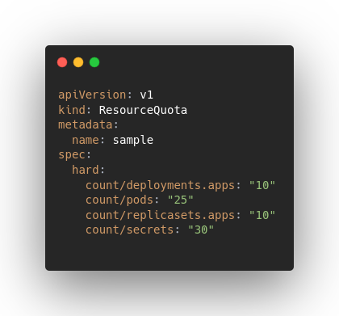

+++
author = 'Adam Otto'
date = '2023-03-03T10:00:00+02:00'
draft = false
image = 'k8s-bug-header.png'
tags = ['Kubernetes', 'Technology', 'Development']
title = 'How to Bring Down a Kubernetes Control Plane with a Single YAML'
+++

Kubernetes is a popular container orchestration platform used by developers to
manage large-scale applications. At its core is the control plane, which handles
the management and communication of the various components that make up a
cluster. However, like any complex software system, kubernetes is not immune to
bugs and vulnerabilities.

In this blog post, we'll dive into a particularly nasty bug in the kubernetes
controller manager that affects version <= 1.26.3 and can bring down the entire
control plane with a single YAML file.

To understand the gravity of this issue, it's important to know that a control
plane outage can have serious consequences for those who rely on kubernetes for
their infrastructure and applications. Without a functioning control plane,
developers are unable to manage or deploy their workloads, which can lead to
costly downtime and lost revenue. Despite the severity of this bug, as of the
time of writing this article, none of the major cloud providers have addressed
the issue by itself and rely on the user's platform teams to mitigate it.

In the following sections, we'll explore the specifics of the kubernetes
controller bug and provide guidance on how to mitigate the risk of a control
plane outage.

## **TL;DR**

The Kubernetes controller bug we'll be discussing in this post allows for an
infinite loop of pod creation, ultimately causing the API server to become
unresponsive. This can be triggered by applying a k8s deployment manifest with a
large payload and enforcing a fail state in the pod, leading to a continuous
cycle of pod creation. In this post, we'll go into further detail on how this
bug works and how to prevent it from bringing down the kubernetes control plane.

## 

## Deep dive

As shown in the GIF above, applying a malicious manifest to the API server
triggers an infinite loop of pod creation. Let's take a closer look at the
malicious manifest itself.

Upon inspection, you'll notice that its payload is intentionally large, capable
of reaching up to 1.5MiB (depending on the etcd system limits), and it sets an
unsafe sysctl (
<https://kubernetes.io/docs/tasks/administer-cluster/sysctl-cluster/#safe-and-unsafe-sysctls>).
Because the kubelet is not configured to support this specific unsafe sysctl, it
marks the pod as failed and triggers the bug.

The large payload and unsafe sysctl settings generate high pressure on the etcd
and API server, as well as on any controllers that are watching pods (such as
kubelet and CoreDNS). As a result, it's only a matter of time before the
system's OOM (Out Of Memory) manager kills one or more of these components,
ultimately bringing down the entire control plane.

So what's the underlying cause of this behavior in Kubernetes? The culprit lies
in the Kubernetes controller-manager, specifically in the ReplicaSet controller,
which is one of its many controllers. When we run the command kubectl apply -f
deployment.yaml, the persisted deployment resource goes through a series of
controllers, each performing a different translation.

First, the deployment is translated into ReplicaSets. Then, the ReplicaSet
controller translates its definition into pods. Once the pods are created, the
scheduler controller determines where the pods should be deployed. Finally,
another controller - kubelet ensures that the pod is created on the target node
and updates its status with the result.

## Code analysis

Let's take a closer look at the code to understand what happens when a pod
status result is marked as "failed". In the main sync loop of the ReplicaSet
controller
(<https://github.com/kubernetes/kubernetes/blob/v1.26.3/pkg/controller/replicaset/replica_set.go#L658-L723>),
every time a ReplicaSet sync event is received, it lists all the pods that
belong to the ReplicaSet in question and filters them for active ones. The
active pods are those that are not deleted (deletionTimestamp is nil) and are
not in the "Failed" or "Succeeded" phase, according to Kubernetes documentation:

- "Succeeded" means that all containers in the pod have voluntarily terminated
  with a container exit code of 0, and the system is not going to restart any of
  these containers.
- "Failed" means that all containers in the pod have terminated, and at least
  one container has terminated in a failure (exited with a non-zero exit code or
  was stopped by the system).

As a result, since created pod with unsafe sysctl is marked as failed, the list
of active pods is empty, and it is passed to the next function, which is
responsible for managing and adjusting pod replicas
(<https://github.com/kubernetes/kubernetes/blob/v1.26.3/pkg/controller/replicaset/replica_set.go#L553-L653>).
Since the difference between the active and expected number of pods is always
negative (0 - \<replicas number in the deployment>)
(<https://github.com/kubernetes/kubernetes/blob/v1.26.3/pkg/controller/replicaset/replica_set.go#L554>),
the pods will be created at every iteration of the sync loop.

You might be wondering why we don't observe this behavior for "CrashLoopBackoff"
or "ImagePullBackoff" errors. That's because their corresponding phases are
"Pending" and "Running", respectively, so they will always be included in the
list of active pods.\
While it is fortunate that inducing pods to enter a failed state through the
replicaset controller is not easy, there are still some ways to do so. For more
information on these methods, please refer to the links in the references
section.

## Managed kubernetes

Even managed Kubernetes services such as AKS and GKE are susceptible to this
issue. During research for this blog post, I was able to bring down control
planes for both AKS and GKE. Neither of these services comes with default safety
mechanisms to prevent a DOS attack on the control plane, and after running this
bug for a prolonged period, the control planes started timing out and eventually
became unusable. Although they eventually recovered, it's likely that their
backing etcd instances scaled up and were able to perform a successful
compaction. Nonetheless, the downtime was noticeable and unacceptable for
production environments.

Unfortunately, I didn't have a chance to run this bug against EKS. If you're
feeling adventurous and have an EKS instance in your development environment, I
encourage you to give this bug a try and let me know your results! Just be sure
to keep it isolated from your production environment.

## Mitigation

To mitigate this bug, one possible solution is to use ResourceQuotas to set a
limit on the number of pods that can be created in the cluster. However, it's
important to note that simply setting a limit on the number of running pods is
not enough, as the ResourceQuota must be applied to the count of the actual pod
objects in the storage (etcd). This can be done using the count statement in the
ResourceQuota definition (see
<https://kubernetes.io/docs/concepts/policy/resource-quotas/#object-count-quota>
for more details). By properly configuring ResourceQuotas, you can ensure that
the cluster won't be overwhelmed with too many pods, thus avoiding potential
downtime or performance issues.

In addition to setting a limit on the number of pods, it is equally important to
ensure that the Kubernetes resources being deployed by the platform's users are
thoroughly audited to prevent situations like this from occurring. This can be
done by implementing GitOps practices, where kubernetes resources are first
reviewed and approved before they are deployed to the cluster.

However, in the event that a malicious workload does make it through and is
deployed in the cluster, it's important to have admission webhooks such as
opa-gatekeeper ( <https://github.com/open-policy-agent/gatekeeper>) in place.
Admission webhooks are essentially plugins that can be used to intercept
requests to the Kubernetes API server and apply custom validation logic before a
resource is persisted in the etcd and consumed by controllers.

Opa-gatekeeper is an open-source admission webhook that allows policies to be
defined and enforced for Kubernetes resources.

To effectively use opa-gatekeeper, it's important to have clear policies and
boundaries defined by the platform team on what users are allowed to deploy.
This can be a large topic and is a good candidate for a future blog post.

## Conclusion

To maintain a healthy and secure Kubernetes cluster, it is important to properly
manage and audit the resources being deployed. GitOps practices can help ensure
that only validated resources are deployed, while admission webhooks like
opa-gatekeeper can prevent malicious workloads from being persisted in the etcd
and consumed by operators and controllers. However, it ultimately falls on the
platform team to set proper boundaries and policies to guide users in their
deployments and prevent potential vulnerabilities. By taking these measures, the
platform team can help ensure the reliability and security of the Kubernetes
cluster.

#### References

- <https://github.com/kubernetes/kubernetes/issues/72593>
- <https://github.com/kubernetes/kubernetes/issues/89007>
- <https://github.com/kubernetes/kubernetes/issues/89067>
- <https://github.com/kubernetes/kubernetes/issues/89068>
