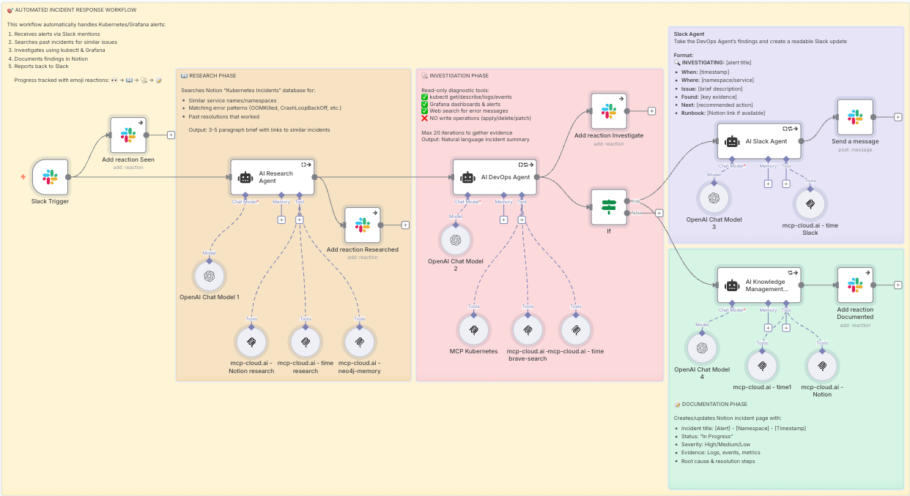

+++
date = '2025-10-24T15:15:30+02:00'
draft = false
title = 'Workshop Retrospective: We Built AI Agents That Actually Work'
author = 'Alex Giurgiu & Valentin Stoican'
image = 'workshop-retrospective-ai-agents-1.jpg'
tags = ['ai agents', 'mcp', 'workflow automation', 'incident response', 'platform engineering', 'kubernetes', 'fikaworks day']
+++

Last Friday, twenty-odd engineers and not only, spent two hours getting their hands dirty with MCP servers and AI agents. This was the Hands-on AI workshop with MCP at [FikaWorks Day](https://fika.works/fikaworks-day/), and I'm still processing what we learned.

Not from slides. Not from theory. From actually building workflows and understanding how this stuff works in practice.

## 1. What We Set Out to Do

The plan was straightforward: teach engineers how to build workflows using MCP servers, show them what's possible with AI agents, and make sure everyone left understanding the fundamentals.

Two hours. Real code. Working examples.

I've run enough workshops to know two hours isn't long. You can either go deep on one thing or broad on many things. We chose broad. Get people understanding the landscape, the patterns, the possibilities. Then let them go deep on their own time.

Friday, that approach worked.

## 2. What Actually Happened

We started with the fundamentals - what MCP is, why it exists, how it differs from writing custom integrations for every tool you want to connect.

Then we dove into [MCP Cloud](https://mcp-cloud.ai), which is where this stops being theoretical. You can talk about protocols all day, but until you're actually building workflows that wire together real systems, it's just words.

The first hour was about building. People created workflows using MCP servers. Connecting Slack, GitHub, Kubernetes. Understanding how these servers expose capabilities. How workflows orchestrate them. How AI fits into the picture.

Not everyone got everything working. That's fine. The goal wasn't perfect execution. It was understanding the patterns well enough to build your own later.

## 3. The OnCall Agent Demo

We demoed the [OnCall Agent workflow](https://raw.githubusercontent.com/seqvence/mcp-cloud-workflows/refs/heads/main/workflows/OnCall_Agent_Slack.json). Not built live - we didn't have time for that. But walked through it in detail.

What it does:
- Monitors infrastructure through MCP servers
- Receives alerts when things break
- Uses Claude to understand context and severity
- Routes incidents to the right people via Slack
- Makes on-call less painful

The interesting bit wasn't any individual piece. It was how they compose. How you define capabilities through MCP servers, how the AI orchestrates them, how the workflow ties everything together.

People asked good questions. "How can I use AI locally?" "How does it handle edge cases?" "What happens when the AI makes the wrong decision?" "How do you test this?" 

Those are the right questions. Not "how do I make this work?" but "how do I make this work reliably?"

## 4. What People Actually Learned

Two hours isn't enough to master MCPs. But it's enough to understand what it is, why it matters, and how to start using it.

By the end of Friday, people understood:
- The difference between MCP servers and traditional integrations
- How workflows compose multiple servers into useful systems
- Where AI fits in the architecture (and where it doesn't)
- What's possible with this approach
- Where to start when building their own

That's not everything. But it's enough. Enough to go back to their companies and start experimenting. Enough to look at their infrastructure problems and think "could an AI agent help here?"

## 5. The Conceptual Shift

The biggest learning wasn't technical. It was conceptual.

Most engineers think about automation as explicit scripts. Do this, then this, then this. If X happens, do Y.

MCP shifts that thinking. You define capabilities - here's what this system can do - and let the AI figure out the sequence. It's more about describing what you want than prescribing how to get there.

This takes getting used to. "How do I know it'll do the right thing?" You don't. You test it. You add constraints. You iterate.

But once people got past that initial discomfort, you could see them thinking differently. Not "how do I script this?" but "how do I describe this?"

That shift matters.

## 6. What We Didn't Cover

Two hours means trade-offs. We didn't get into:
- Production deployment strategies
- Monitoring and observability for AI agents
- Cost management when you're making lots of API calls
- Security boundaries between MCP servers
- Testing AI agent behavior systematically
- Building your own MCP servers

Not because these aren't important. Because you need to understand the basics before you worry about production concerns.

Several people asked about these afterward. Good. That means they're thinking ahead. That means they're planning to actually use this.

## 7. What Surprised Me

Two things surprised me about Friday.

First, how little resistance there was to the AI-orchestrated approach. I expected more "but how do I control it?" Instead, people immediately grasped the value. Maybe we're past the point where engineers need convincing that AI can help with infrastructure work.

Second, how many people already had use cases in mind. This wasn't theoretical curiosity. People were thinking about their actual infrastructure, their actual problems. "Could this help with incident triage?" "What about compliance checks?" "How would this work for automated runbooks?"

Real problems. Not hypotheticals.

That tells me we're past the hype phase. We're into the "how do I actually use this?" phase.

## 8. What Happens Next

The workshop's over, but the learning continues.

The [OnCall Agent workflow is on GitHub](https://raw.githubusercontent.com/seqvence/mcp-cloud-workflows/refs/heads/main/workflows/OnCall_Agent_Slack.json). People can study it, fork it, modify it. Use it as a template for their own agents.

Several attendees are already planning to build MCP-based workflows for their infrastructure. We'll see what works, what breaks, what needs changing. That's how you learn - by building things.

We'll probably run this again. Maybe longer next time. Maybe more time for hands-on building. Maybe focused on specific use cases.

But for a first run, for two hours? Friday worked.

## 9. Resources

If you missed Friday but want to understand this stuff:

- [MCP Cloud platform](https://mcp-cloud.ai) - where you actually host MCP servers
- [OnCall Agent workflow](https://raw.githubusercontent.com/seqvence/mcp-cloud-workflows/refs/heads/main/workflows/OnCall_Agent_Slack.json) - the complete working example we demoed
- [FikaWorks Day recap](https://fika.works/fikaworks-day/) - what else happened beyond this workshop

Or just start building. That's how you actually learn. Reading about MCPs is fine. Building with MCPs is better.

## 10. The Bigger Picture

Here's what Friday reinforced for me.

AI infrastructure isn't magic. It's engineering. It's patterns and protocols and understanding trade-offs. It's the same skills you use for any infrastructure work, applied to a new domain.

The engineers who figure this out now - who understand how to build workflows with MCP servers, how to compose AI capabilities, how to make these systems reliable - they're the ones building the infrastructure everyone else will use in a few years.

That's not hype. That's pattern recognition. It's what happened with containers, with Kubernetes, with every infrastructure wave. The early adopters who actually built things defined the patterns everyone else followed.

Friday was about helping more engineers understand these patterns. Not making them experts. Just giving them enough knowledge to start experimenting.

If you were there, thanks for coming. If you weren't, we'll probably do this again.

Until then, go build something.
